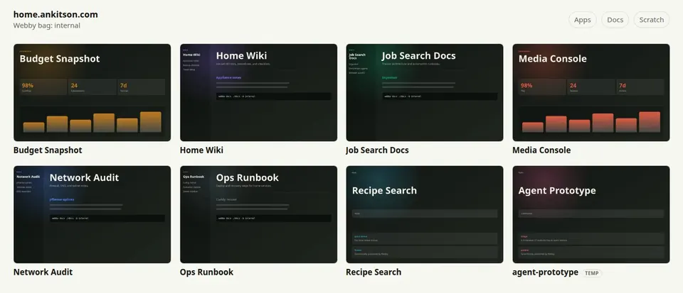
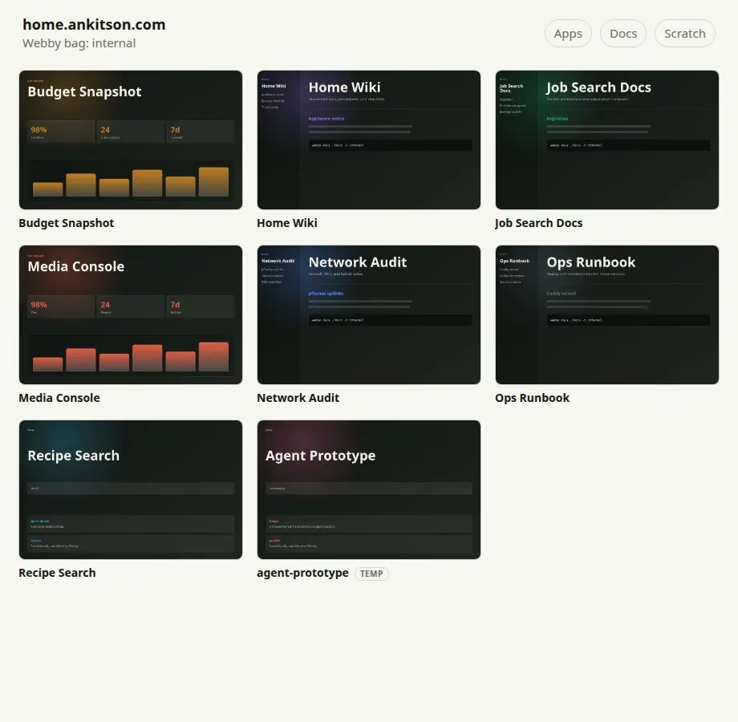

<h1 align="center">webby</h1>

<p align="center">
  Publish a static site in one command.
</p>

<p align="center">
  <a href="https://crates.io/crates/webby-deploy"></a>
  <a href="https://github.com/ankitson/webby"></a>
  <a href="Cargo.toml"></a>
</p>

Webby is for the moment when you already have a static thing and just need it
to live somewhere useful.

Give Webby an HTML file, a folder with `index.html`, or a directory of Markdown
files. It copies the artifact into a named **bag**, generates a small launcher
page with cards and screenshots, writes reusable card data, and serves or
publishes the bag through the provider you choose.

No framework, app server, database, or build pipeline is required. Start with
local preview; use Tailscale, Cloudflare Pages, Caddy, or a custom command when
the same artifact needs to reach other people or machines.

## Install

```sh
cargo install webby-deploy
```

The installed binary is named `webby`.

From a checkout:

```sh
cargo install --path .
```

## Quickstart

Preview an existing HTML file locally, with no config:

```sh
webby add ./site.html -b local
webby serve -b local
```

Open `http://localhost:8765/site.html`.

Preview a built static site folder the same way:

```sh
webby add ./dist -b local --name my-site
webby serve -b local
```

Folders should contain `index.html`; Webby serves that folder at
`http://localhost:8765/my-site/`.

## Preview

Webby pages are plain static pages: a generated card index, optimized previews,
and a reusable card manifest beside it. The result is easy to host, inspect,
cache, embed, or delete.

| Homeserver-style bag | Docs and apps together |
| --- | --- |
|  |  |

## Why Webby

Webby is deliberately small. It does not try to become your app platform, docs
platform, or homepage CMS. It does one job: take static artifacts you already
have and make them reachable.

That makes it a good fit for:

- AI-agent prototypes you want to inspect, keep, or share after a session.
- Personal tools and homeserver apps that deserve a nicer index than a folder
  listing.
- Repo docs that should be published next to the dashboards and tools they
  explain.
- Generated reports, experiments, and scratch pages that should not require a
  new deployment project.
- Host pages that want card data and screenshots without giving Webby control
  over the homepage.

The constraint is intentional: if your artifact can be served as static files,
Webby can probably publish it. If it needs auth, a database, background jobs, or
server-side routing, keep those in your real app and use Webby for the static
surfaces around it.

## The Mental Model

**Apps** are static artifacts: either one `.html` file, a folder with
`index.html`, or a generated docs app from Markdown.

**Bags** are named staging directories with a hosting provider attached. The
built-in bags cover local preview, private Tailscale, temporary public Funnel,
Cloudflare Pages, and optional Caddy/internal hosting.

**Deploying** a bag regenerates its static index and card manifest, refreshes
missing or stale preview images, then asks the provider to make the bag
available at its URL.

Most usage is just:

```sh
webby add <file-or-folder> -b <bag>
webby deploy -b <bag>
```

For the `local` bag, use `webby serve` instead of `deploy`.

## Use Cases

Use Webby when the work is done and the remaining problem is distribution:

- **Local preview:** stage a generated HTML report or prototype, then inspect it
  at `localhost` without setting up a project-specific server.
- **Homeserver launcher:** keep small dashboards, one-off tools, and repo docs
  in one internal bag with screenshots and a generated index.
- **Repo docs hub:** run `webby docs ./docs -b internal` from any repo and get a
  navigable static docs app next to your tools.
- **Temporary public demo:** push a folder through Tailscale Funnel when you
  need a short-lived public URL from the current machine.
- **Durable public mini-site:** publish the same static artifact through
  Cloudflare Pages with `webby pub`.

Embedding Webby means another page owns the homepage while Webby owns the app
inventory. Run with `--no-index`; Webby still writes the useful parts:
`webby-cards.json`, `webby-card-grid.js`, and `webby-previews/`. Your homepage
can then render those cards inside its own navigation, theme, auth boundary, or
layout.

## 1. Local Preview

Local preview is the safest path and needs no config:

```sh
webby add ./clock.html -b local
webby serve -b local
```

Useful local commands:

```sh
webby ls -b local
webby open clock -b local
webby rm clock -b local
webby where
```

`webby ls` lists every configured bag when you omit `-b`.

## 2. Markdown Docs

Publish a Markdown directory as a static docs app:

```sh
webby docs ./docs -b local \
  --name project-docs \
  --title "Project Docs" \
  --property category=Documents

webby serve -b local
```

Webby scans Markdown files within `--depth` directories below the source root
(default `3`), renders them with a sidebar, rewrites in-root `.md` links to the
generated `.html` pages, and copies linked in-root assets up to
`--max-asset-size-mib` MiB each (default `25`).

If the directory has `index.md`, it becomes the docs homepage. Otherwise Webby
writes a generated homepage that links to the discovered pages. Optional YAML
frontmatter can set page `title`, `description`, `tags`, `type`, `resource`,
and `timestamp`.

## 3. Card Metadata And Previews

Every generated bag includes:

- `index.html`: a static launcher page, unless disabled.
- `webby-cards.json`: normalized card data for every staged app.
- `webby-card-grid.js`: a reusable card-grid custom element for host pages.
- `webby-previews/*.webp`: optimized screenshots when preview capture succeeds.

Set card metadata while staging:

```sh
webby add ./network-audit.html -b internal \
  --title "Network Audit" \
  --description "Internal network and DNS audit notes." \
  --property category=Documents \
  --property kind=report
```

Or put metadata in the app itself:

```html
<script type="application/webby+json">
{
  "title": "Network Audit",
  "description": "Internal network and DNS audit notes.",
  "properties": {
    "category": "Documents",
    "kind": "report"
  }
}
</script>
```

For standalone apps, put that block in the `.html` file. For folder apps, put
it in `index.html`. If Webby metadata is absent, Webby falls back to the page
`<title>` and `<meta name="description">`.

Preview capture runs automatically on `add`, `docs`, `pub`, and `deploy`.
Pass `--no-preview` when you only want to refresh metadata/index files. Run an
explicit refresh with:

```sh
webby preview -b internal
webby preview project-docs -b internal --force
```

Preview capture uses `uvx shot-scraper` plus Pillow. Generated preview URLs get
a content hash query string when the image exists, so hosts can cache preview
images aggressively while still picking up changed thumbnails.

## 4. Private Or Public Publishing

Built-in bags:

| Bag | Provider | Use it for | Command |
| --- | --- | --- | --- |
| `local` | Local HTTP server | Safe preview on your machine | `webby serve -b local` |
| `tailnet` | Tailscale Serve | Private HTTPS on your tailnet | `webby deploy -b tailnet` |
| `funnel` | Tailscale Funnel | Temporary public HTTPS from this machine | `webby deploy -b funnel` |
| `cf-pages` | Cloudflare Pages | Durable public HTTPS | `webby pub <path>` or `webby deploy -b cf-pages` |
| `internal` | Caddy compatibility | Existing internal static host | Added when `INTERNAL_URL` or `INTERNAL_DIR` is set |

Private Tailscale:

```sh
webby add ./dashboard -b tailnet
webby deploy -b tailnet
```

Temporary public Funnel:

```sh
webby add ./demo -b funnel
webby deploy -b funnel
```

Cloudflare Pages:

```sh
export CLOUDFLARE_ACCOUNT_ID=...
export CLOUDFLARE_API_TOKEN=...

webby pub ./landing-page --name landing-page
```

`webby pub` is shorthand for staging into the `cf-pages` bag and deploying it.
For legacy configs, an explicit `public` bag still wins; otherwise the old
`public` name is accepted as a compatibility alias for `cf-pages`.

## 5. Embedding Webby In A Larger Site

Sometimes Webby should manage apps and card data, while another site owns the
homepage. Use `--no-index` for that:

```sh
webby add ./tool.html -b internal --no-index
webby deploy -b internal --no-index
```

That keeps `webby-cards.json`, `webby-card-grid.js`, and previews, but removes
the generated root `index.html`.

Host pages can consume `webby-cards.json` directly or use the emitted custom
element:

```html
<script type="module" src="/webby/webby-card-grid.js"></script>
<webby-card-grid src="/webby/webby-cards.json" group-by-property="category"></webby-card-grid>
```

For a generated Webby index that still needs shared site chrome, set
`indexChromeDir` in the bag config. Webby will inline optional `head.html` and
`body.html` fragments from that directory.

## 6. Configuration

Start with:

```sh
webby init
```

This writes `~/.config/webby/config.json`. Override paths with:

- `WEBBY_CONFIG`: config file path.
- `WEBBY_DATA_DIR`: default storage root for built-in bags.
- `WEBBY_DEFAULT_BAG`: default bag label.
- `WEBBY_ENV`: optional `KEY=VALUE` env file to load before config.

Minimal custom bag example:

```json
{
  "defaultBag": "local",
  "bags": {
    "tools": {
      "dir": "~/Sites/tools",
      "host": {
        "type": "command",
        "url": "https://tools.example.com",
        "deploy": "rsync -a {dir}/ deploy@example.com:/var/www/tools/"
      }
    }
  }
}
```

Command providers can use `{dir}`, `{label}`, and `{url}` in `deploy`,
`afterAdd`, and `open` templates.

## Command Reference

```sh
webby add <path> [-b bag] [--name name] [--tmp] [--title T] [--description D] [--property K=V] [--no-index] [--no-preview]
webby docs <dir> [-b bag] [--name name] [--title T] [--description D] [--property K=V] [--depth N] [--max-asset-size-mib N] [--no-index] [--no-preview]
webby pub <path> [--name name] [--tmp] [--title T] [--description D] [--property K=V] [--no-index] [--no-preview]
webby deploy -b bag [--port N] [--no-index] [--no-preview]
webby serve [-b bag] [--port N] [--no-index]
webby preview [app] -b bag [--force] [--width PX] [--height PX] [--timeout-secs N]
webby preview-url <url-or-file> <output.webp> [--force] [--width PX] [--height PX] [--timeout-secs N]
webby ls [-b bag]
webby open <name> [-b bag]
webby rm <name> [-b bag]
webby domain <hostname> -b cf-pages
webby where
webby init [--force]
```

Run `webby <command> --help` for exact option descriptions.

## Development

```sh
just check
just install
```

Maintainers can publish this repository's docs through the shared docme/Webby
workflow:

```sh
just docs-deploy
```
